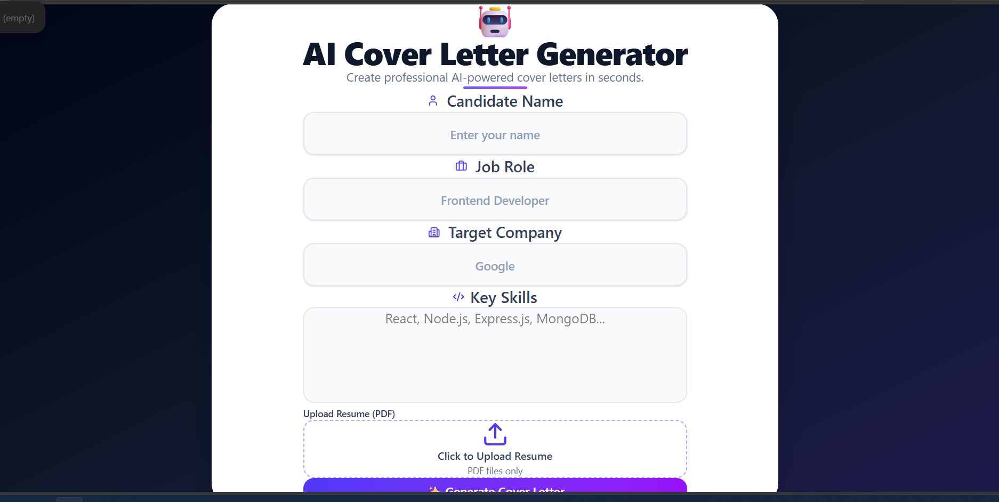
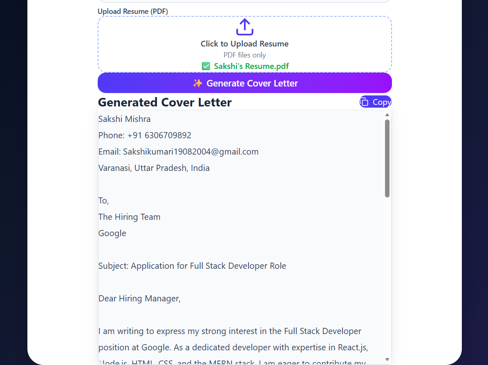

# 🤖 AI Cover Letter Generator

An AI-powered SaaS web application that generates professional, ATS-friendly cover letters using Google's Gemini API. Users can enter their details, target job information, and skills to instantly create customized cover letters.


---

## 🚀 Features

- ✨ AI-powered ATS-friendly cover letter generation
- 👤 Candidate information form
- 💼 Job role & target company input
- 🛠 Skills input
- 🤖 Google Gemini AI integration
- 📋 Copy generated cover letter to clipboard
- 📄 Resume upload UI
- ⏳ Loading state while AI generates content
- 📱 Fully responsive modern UI
- 🔒 Secure API key management using `.env`

---

## 📸 Screenshots

### Home Page



### Generated Cover Letter


---

## 🛠 Tech Stack

### Frontend

- React.js
- Vite
- Tailwind CSS

### AI

- Google Gemini API

### Icons

- Lucide React

### State Management

- React Hooks (`useState`)

---

## 📂 Folder Structure

```text
src/
│
├── components/
│   ├── Form.jsx
│   ├── InputField.jsx
│   ├── CoverLetter.jsx
│   └── ResumeUpload.jsx
│
├── services/
│   └── gemini.js
│
├── utils/
│   ├── templateGenerator.js
│   └── extractResumeText.js
│
├── App.jsx
├── main.jsx
└── index.css
```

---

## ⚙️ Installation

### Clone the repository

```bash
git clone https://github.com/your-username/AI-cover-letter-generator.git
```

### Navigate into project

```bash
cd AI-cover-letter-generator
```

### Install dependencies

```bash
npm install
```

### Run the project

```bash
npm run dev
```

---

## 🧠 How It Works

1. User enters:
   - Candidate Name
   - Job Role
   - Target Company
   - Skills
2. User optionally uploads a resume.
3. The application creates a prompt using the entered information.
4. The prompt is sent to the Google Gemini API.
5. Gemini generates a professional ATS-friendly cover letter.
6. The generated cover letter is displayed and can be copied with one click.

---

## 📚 Concepts Used

- React Components
- Props
- useState Hook
- Event Handling
- Controlled Components
- Async/Await
- Fetch API
- Environment Variables
- Prompt Engineering
- API Integration
- Conditional Rendering

---

## 📜 License

This project is licensed under the MIT License.